# PACE E3SM Simulation Metadata Parsing Analysis for SimBoard

**Date:** 2026-01-14  
**Purpose:** Analyze PACE's E3SM simulation metadata parsing logic for SimBoard reimplementation  
**Scope:** **SimBoard-relevant metadata only** - configuration, provenance, and machine context  
**Out of Scope:** Detailed timing profiles, memory dumps, performance analytics

---

## E3SM Metadata Parsing Flow Diagram

The following diagram illustrates the complete metadata parsing flow from input artifacts to SimBoard-ready output:

```mermaid
flowchart TD
    Start([Experiment Archive]) --> Extract[Extract ZIP/TAR.GZ]
    Extract --> Discover[Discover exp* directories]
    
    Discover --> FindFiles[Locate Required Files]
    FindFiles --> Check{All Required<br/>Files Present?}
    
    Check -->|No| Error1[Return Error:<br/>Missing Required Files]
    Check -->|Yes| ParseTiming[Parse e3sm_timing.*]
    
    ParseTiming --> ExtractCore[Extract Core Metadata:<br/>case, machine, user, dates,<br/>grid, compset, run_config]
    
    ExtractCore --> ParseReadme[Parse README.case.*]
    ParseReadme --> ExtractResComp[Extract:<br/>resolution short,<br/>compset short,<br/>creation_date]
    
    ExtractResComp --> ParseGit[Parse GIT_DESCRIBE.*]
    ParseGit --> ExtractVersion[Extract:<br/>version string]
    
    ExtractVersion --> ParseEnvCase{Parse env_case.xml<br/>Optional}
    ParseEnvCase -->|Success| ExtractGroup[Extract:<br/>case_group]
    ParseEnvCase -->|Missing/Error| WarnGroup[Warning: NULL case_group]
    
    ExtractGroup --> ParseEnvBuild{Parse env_build.xml<br/>Optional}
    WarnGroup --> ParseEnvBuild
    
    ParseEnvBuild -->|Success| ExtractCompiler[Extract:<br/>compiler, mpilib]
    ParseEnvBuild -->|Missing/Error| WarnCompiler[Warning: NULL compiler]
    
    ExtractCompiler --> ParseScripts{Parse Scripts<br/>Optional}
    WarnCompiler --> ParseScripts
    
    ParseScripts -->|Success| StoreScripts[Store replay.sh,<br/>run_e3sm.sh as artifacts]
    ParseScripts -->|Missing/Error| SkipScripts[Skip scripts]
    
    StoreScripts --> Normalize[Normalize Metadata]
    SkipScripts --> Normalize
    
    Normalize --> TransformMachine[Transform machine name<br/>to machine_id UUID]
    TransformMachine --> ParseVersion[Parse git version string<br/>into tag + commit hash]
    ParseVersion --> MapFields[Map to SimBoard schema:<br/>- Core fields<br/>- Extra metadata<br/>- Artifacts]
    
    MapFields --> CheckDup{Check for<br/>Duplicate?}
    CheckDup -->|Exists| ReturnExisting[Return existing<br/>Simulation ID]
    CheckDup -->|New| CreateSim[Create SimulationCreate<br/>object]
    
    CreateSim --> Output[Output SimBoard-ready<br/>metadata JSON]
    ReturnExisting --> End([Complete])
    Output --> End
    
    Error1 --> End
    
    style Start fill:#e1f5ff
    style End fill:#e1f5ff
    style Error1 fill:#ffe1e1
    style Output fill:#e1ffe1
    style Normalize fill:#fff4e1
    style MapFields fill:#fff4e1
```



### Flow Diagram Legend

**Input Artifacts:**
- `e3sm_timing.*` - Main timing summary (REQUIRED)
- `README.case.*` - Case creation metadata (REQUIRED)
- `GIT_DESCRIBE.*` - E3SM version info (REQUIRED)
- `CaseDocs.*/env_case.xml.*` - Case group (OPTIONAL)
- `CaseDocs.*/env_build.xml.*` - Compiler info (OPTIONAL)
- `replay.sh.*`, `run_e3sm.sh.*` - Scripts (OPTIONAL)

**Key Parsing Steps:**
1. **File Discovery** - Locate experiment directories and required files
2. **Core Parsing** - Extract metadata from 3 required files (e3sm_timing, README.case, GIT_DESCRIBE)
3. **Optional Parsing** - Extract additional metadata from XML files and scripts
4. **Normalization** - Transform PACE data to SimBoard format
5. **Validation** - Check for duplicates before creating new simulation

**Output:**
- SimBoard `SimulationCreate` object with:
  - Core fields (case_name, compset, grid, machine_id, etc.)
  - Git version info (git_tag, git_commit_hash)
  - Optional metadata (compiler, group_name, mpilib)
  - Extra metadata (lid, user, run_config, etc.)
  - Artifacts (scripts, if available)

---

## 1. Parsing Entrypoints

### 1.1 Main Entry Function

**Function:** `parseData(zipfilename, uploaduser)` in `portal/pace/e3sm/e3smParser/parseE3SM.py`

**Responsibilities:**
- Extracts uploaded zip/tar.gz archives
- Discovers experiment directories (prefixed with `exp`)
- Identifies required files within each experiment
- Orchestrates parsing of all file types
- Handles database insertion and error management

### 1.2 Top-Level Dispatcher

**Function:** `parseData(zipfilename, uploaduser, project)` in `portal/pace/parse.py`

**Responsibilities:**
- Entry point from web application
- Routes to E3SM-specific parser based on `project` parameter
- Sets up logging infrastructure
- Returns status and log filename

### 1.3 Case Directory Discovery

**Algorithm (in parseE3SM.py lines 65-96):**

1. Extract zip file to upload folder
2. Extract any `.tar.gz` files found
3. Look for directories starting with `exp` (e.g., `exp-username-12345`)
4. Walk through each experiment directory to locate specific files

### 1.4 File Discovery Pattern

The parser walks each experiment directory looking for files with specific prefixes (lines 114-139):

```python
Expected file patterns:
- timing.*                  → timingfile
- e3sm_timing.*            → allfile
- README.case.*            → readmefile
- GIT_DESCRIBE.*           → gitdescribefile
- spio_stats.*             → scorpiofile
- memory.*                 → memoryfile
- build_times.txt.*        → buildtimefile
- preview_run.log.*        → previewrunfile
- replay.sh.*              → replayshfile
- run_e3sm.sh.*            → run_e3sm_file
- CaseDocs.*/ (directory)  → casedocs
```

---

## 2. Input Artifacts

### 2.1 Required Files for SimBoard

**Critical Files (SimBoard metadata requires these):**
- `e3sm_timing.*` - Main timing summary file (for case, machine, dates, grid/compset)
- `README.case.*` - Case creation metadata (for resolution and compset details)
- `GIT_DESCRIBE.*` - E3SM version information (for git tag/hash)
- `CaseDocs.*/env_case.xml.*` - Case configuration (for group name)
- `CaseDocs.*/env_build.xml.*` - Build configuration (for compiler)

**Optional Files (enhance SimBoard metadata if available):**
- `replay.sh.*` - Replay script (can be stored as artifact)
- `run_e3sm.sh.*` - Run script (can be stored as artifact)
- Other CaseDocs XML/namelist files (for extra metadata)

**Files NOT Needed for SimBoard:**
- `timing.*` - Detailed GPTL timing data (performance analytics, not core metadata)
- `spio_stats.*` - Scorpio I/O statistics (performance analytics)
- `memory.*` - Memory profiling data (performance analytics)
- `build_times.txt.*` - Build time breakdown (performance analytics)
- `preview_run.log.*` - Job submission info (operational detail, not metadata)

### 2.2 Expected Directory Layout (SimBoard Focus)

```
upload_folder/
└── experiment_name/         # e.g., "exp-username-12345"
    ├── e3sm_timing.case_name.LID          [REQUIRED]
    ├── README.case.LID.gz                 [REQUIRED]
    ├── GIT_DESCRIBE.LID.gz                [REQUIRED]
    ├── replay.sh.LID.gz                   [OPTIONAL - artifact]
    ├── run_e3sm.sh.timestamp.LID.gz       [OPTIONAL - artifact]
    └── CaseDocs.LID/                      [REQUIRED]
        ├── env_case.xml.LID.gz            [REQUIRED - group_name]
        ├── env_build.xml.LID.gz           [REQUIRED - compiler]
        ├── env_run.xml.LID.gz             [OPTIONAL - extra metadata]
        └── (other XML/namelist files)     [OPTIONAL - extra metadata]
```

**Notes:**
- `LID` = Local ID timestamp (e.g., `43235257.210608-222102`)
- Files marked [REQUIRED] are needed for SimBoard core metadata
- Files marked [OPTIONAL] can enhance SimBoard's `extra` field or artifacts
- Performance files (timing.*, spio_stats.*, memory.*, build_times.txt.*) are NOT needed

### 2.3 File Format Details (SimBoard-Relevant Only)

| File Type | Format | Compression | Parser Module | SimBoard Use |
|-----------|--------|-------------|---------------|--------------|
| e3sm_timing | Text | Optional .gz | parseE3SMTiming.py | Core metadata extraction |
| README.case | Text | .gz | parseReadMe.py | Resolution & compset |
| GIT_DESCRIBE | Text | .gz | parseModelVersion.py | Git version info |
| env_case.xml | XML | .gz | parseXML.py | Group name |
| env_build.xml | XML | .gz | parseXML.py | Compiler info |
| replay.sh | Bash script | .gz | parseReplaysh.py | Artifact storage |
| run_e3sm.sh | Bash script | .gz | parseRunE3SMsh.py | Artifact storage |

## 3. Metadata Extraction (SimBoard-Relevant Fields Only)

### 3.1 Core Experiment Metadata (from e3sm_timing.*)

**Source:** `parseE3SMTiming.parseE3SMtiming(filename)`  
**File:** `portal/pace/e3sm/e3smParser/parseE3SMTiming.py`

**SimBoard-Relevant Fields Extracted:**

| Field | Source Pattern | SimBoard Mapping | Description |
|-------|----------------|------------------|-------------|
| case | `Case:` | `name`, `case_name` | Case name |
| lid | `LID:` | `extra.lid` | Local ID (timestamp) |
| machine | `Machine:` | `machine_id` (via lookup) | HPC machine name |
| user | `User:` | `extra.user` | Username who ran simulation |
| curr | `Curr Date:` | `simulation_start_date` | Current date/time of run |
| long_res | `grid:` | `grid_resolution` | Full grid specification |
| long_compset | `compset:` | `compset_alias` | Full component set |
| stop_option | `stop option:` | `extra.stop_option` | Stop criterion (e.g., "ndays") |
| stop_n | `stop_n =` | `extra.stop_n` | Stop value |
| run_length | `run length:` | `extra.run_length` | Duration in days |

**Fields NOT Extracted for SimBoard:**
- Performance metrics (total_pes, mpi_task, pe_count, model_cost, model_throughput)
- Timing data (init_time, run_time, final_time, actual_ocn)
- PE layout component table
- Runtime metrics table

**Parsing Logic:**
- Opens file (handles gzipped or plain text)
- Scans line-by-line for key-value patterns
- Extracts fields using string splitting and pattern matching
- Returns dictionary with extracted values

### 3.2 Case Creation Metadata (from README.case.*)

**Source:** `parseReadMe.parseReadme(readmefilename)`  
**File:** `portal/pace/e3sm/e3smParser/parseReadMe.py`

**SimBoard-Relevant Fields:**

| Field | Source | SimBoard Mapping | Description |
|-------|--------|------------------|-------------|
| res | `--res` argument | `grid_name` | Resolution (e.g., "ne30_ne30") |
| compset | `--compset` argument | `compset` | Component set (e.g., "F2010") |
| date | Line prefix | `extra.creation_date` | Case creation timestamp |

**Parsing Logic:**
- Searches for line containing `create_newcase`
- Extracts command-line arguments
- Handles both `--arg=value` and `--arg value` formats
- Returns dictionary with res, compset, date

### 3.3 Version Information (from GIT_DESCRIBE.*)

**Source:** `parseModelVersion.parseModelVersion(gitfile)`  
**File:** `portal/pace/e3sm/e3smParser/parseModelVersion.py`

**SimBoard-Relevant Field:**
- version: First non-empty line (e.g., "v2.0.0-beta.3-3091-g3219b44fc")

**SimBoard Mapping:**
- Parse to extract `git_tag` (e.g., "v2.0.0-beta.3")
- Parse to extract `git_commit_hash` (e.g., "3219b44fc")

**Parsing Logic:**
- Opens file (handles gzipped or plain text)
- Reads first non-empty line
- Returns version string as-is

### 3.4 CaseDocs Configuration Files

**Source:** `parseCaseDocs.loaddb_casedocs(casedocpath, db, currExpObj)`  
**File:** `portal/pace/e3sm/e3smParser/parseCaseDocs.py`

#### A. env_case.xml - Case Group

**Parser:** `parseXML.loaddb_xmlfile(xmlpath)` + `getCaseGroup(jsondata)`

**SimBoard-Relevant Field:**
- `case_group` from `CASE_GROUP` entry → SimBoard `group_name`

**Parsing Logic:**
1. Unzip XML file
2. Parse XML to JSON via xmltodict
3. Navigate to `file.group` array
4. Find group with `@id='case_desc'`
5. Find entry with `@id='CASE_GROUP'`
6. Extract `@value`

#### B. env_build.xml - Compiler Info

**Parser:** `parseXML.loaddb_xmlfile(xmlpath)` + `getEnvBuild(jsondata)`

**SimBoard-Relevant Fields:**
- `compiler` from `COMPILER` entry → SimBoard `compiler`
- `mpilib` from `MPILIB` entry → SimBoard `extra.mpilib`

**Parsing Logic:**
1. Unzip and parse XML to JSON
2. Navigate to `file.group` array
3. Find group with `@id='build_macros'`
4. Extract `COMPILER` and `MPILIB` entry values

### 3.5 Script Files (Optional Artifacts)

**Source:** `parseReplaysh.load_replayshFile()`, `parseRunE3SMsh.load_rune3smshfile()`  
**Files:** `portal/pace/e3sm/e3smParser/parseReplaysh.py`, `parseRunE3SMsh.py`

**SimBoard Use:**
- Store as artifacts with `ArtifactKind.RUN_SCRIPT`
- Extraction: Read entire gzipped file content as text

---

## 4. Control Flow (SimBoard Metadata Extraction)

### 4.1 Minimal Parsing Sequence for SimBoard

For SimBoard ingestion, only these parsing steps are required:

**Step 1: Parse e3sm_timing file**
- Function: `parseE3SMTiming.parseE3SMtiming(filename)` 
- Extracts: case, lid, machine, user, exp_date, long_res, long_compset, stop_option, stop_n, run_length
- **Required:** YES - Fails if missing

**Step 2: Parse README.case file**
- Function: `parseReadMe.parseReadme(readmefilename)`
- Extracts: res (short), compset (short), creation_date
- **Required:** YES - Fails if missing

**Step 3: Parse GIT_DESCRIBE file**
- Function: `parseModelVersion.parseModelVersion(gitfile)`
- Extracts: version string
- **Required:** YES - Fails if missing

**Step 4: Parse CaseDocs/env_case.xml**
- Function: `parseXML.loaddb_xmlfile()` + `getCaseGroup()`
- Extracts: case_group
- **Required:** NO - Gracefully skipped if missing

**Step 5: Parse CaseDocs/env_build.xml**
- Function: `parseXML.loaddb_xmlfile()` + `getEnvBuild()`
- Extracts: compiler, mpilib
- **Required:** NO - Gracefully skipped if missing

**Step 6: (Optional) Store replay.sh and run_e3sm.sh as artifacts**
- Function: `parseReplaysh.load_replayshFile()`, `parseRunE3SMsh.load_rune3smshfile()`
- Stores: Script content for artifact storage
- **Required:** NO - Gracefully skipped if missing

### 4.2 Steps NOT Needed for SimBoard

PACE's full parsing includes these steps that SimBoard doesn't need:

- ❌ **Parse timing.* (model timing)** - Performance data, not metadata
- ❌ **Parse spio_stats.* (I/O stats)** - Performance data, not metadata
- ❌ **Parse memory.* (memory profile)** - Performance data, not metadata
- ❌ **Parse build_times.txt** - Build performance, not metadata
- ❌ **Parse preview_run.log** - Job submission details, not core metadata
- ❌ **Parse other CaseDocs files** - Optional unless storing as extra metadata
- ❌ **Insert PE layout table** - Performance data, not metadata
- ❌ **Insert component runtime table** - Performance data, not metadata
- ❌ **Store in MinIO** - SimBoard handles its own storage

### 4.3 Error Handling for SimBoard

**Strategy:** Fail-fast for required metadata, skip-on-error for optional

**Required Files Missing:**
- If e3sm_timing.*, README.case.*, or GIT_DESCRIBE.* missing → Return error, do not create Simulation
- Error message: "Missing required file: {filename}"

**Optional Files Missing:**
- If CaseDocs XML files missing → Log warning, continue with NULL values
- Warning message: "No {filename} file, setting {field} to NULL"

**Parse Errors:**
- If required file parsing fails → Return error, do not create Simulation
- If optional file parsing fails → Log warning, continue

**Example Error Handling:**
```python
def parse_for_simboard(exp_dir):
    result = {
        'success': False,
        'data': {},
        'errors': [],
        'warnings': []
    }
    
    # Required: e3sm_timing
    e3sm_timing_file = find_file(exp_dir, 'e3sm_timing.*')
    if not e3sm_timing_file:
        result['errors'].append("Missing required file: e3sm_timing.*")
        return result
    
    try:
        timing_data = parseE3SMTiming.parseE3SMtiming(e3sm_timing_file)
        result['data'].update(timing_data)
    except Exception as e:
        result['errors'].append(f"Failed to parse e3sm_timing: {e}")
        return result
    
    # Required: README.case
    readme_file = find_file(exp_dir, 'README.case.*')
    if not readme_file:
        result['errors'].append("Missing required file: README.case.*")
        return result
    
    try:
        readme_data = parseReadMe.parseReadme(readme_file)
        result['data'].update(readme_data)
    except Exception as e:
        result['errors'].append(f"Failed to parse README.case: {e}")
        return result
    
    # Required: GIT_DESCRIBE
    git_file = find_file(exp_dir, 'GIT_DESCRIBE.*')
    if not git_file:
        result['errors'].append("Missing required file: GIT_DESCRIBE.*")
        return result
    
    try:
        version = parseModelVersion.parseModelVersion(git_file)
        result['data']['version'] = version
    except Exception as e:
        result['errors'].append(f"Failed to parse GIT_DESCRIBE: {e}")
        return result
    
    # Optional: env_case.xml
    env_case = find_file(exp_dir, 'CaseDocs.*/env_case.xml.*')
    if env_case:
        try:
            xml_data = parseXML.loaddb_xmlfile(env_case)
            case_group = getCaseGroup(json.loads(xml_data))
            result['data']['case_group'] = case_group
        except Exception as e:
            result['warnings'].append(f"Failed to parse env_case.xml: {e}")
    
    # Optional: env_build.xml
    env_build = find_file(exp_dir, 'CaseDocs.*/env_build.xml.*')
    if env_build:
        try:
            xml_data = parseXML.loaddb_xmlfile(env_build)
            build_data = getEnvBuild(json.loads(xml_data))
            result['data'].update(build_data)
        except Exception as e:
            result['warnings'].append(f"Failed to parse env_build.xml: {e}")
    
    result['success'] = len(result['errors']) == 0
    return result
```

### 4.4 Duplicate Detection

PACE checks for duplicates using: `(user, machine, exp_date, case)`

**SimBoard should adapt this to:**
- Check if Simulation already exists with same `(case_name, machine_id, simulation_start_date)`
- Return existing Simulation ID if found
- Do not parse or create duplicate

---

## 5. Implicit Assumptions

### 5.1 HPC-Specific Paths

**Assumptions about caseroot and timeroot:**
- Paths are stored as-is from e3sm_timing file
- Examples: `/global/cscratch1/sd/<user>/<case>`
- No validation or normalization performed
- Assumes Unix-style paths

### 5.2 Machine/Compiler Assumptions

**Supported machines (examples from data):**
- cori-knl
- cori-haswell
- Other NERSC/DOE machines

**Compilers (from env_build.xml):**
- intel, gnu, etc.

**No validation** - stores whatever is in the files

### 5.3 E3SM Version Coupling

**Version String Format:**
- Expects Git describe format: `v{major}.{minor}.{patch}-{commits}-g{hash}`
- Example: `v2.0.0-beta.3-3091-g3219b44fc`
- No version-specific parsing logic (version-agnostic)

**GPTL Format Versions:**
- Parser auto-detects three GPTL output formats
- Backwards compatible with old formats

**Scorpio Stats Versions:**
- Checks for `spio_stats_version` field
- Filters out very old unsupported formats
- Limits to 10 old format files per experiment

### 5.4 File Naming Conventions

**Implicit patterns:**
- Files use `.` as separator: `{prefix}.{case}.{LID}`
- LID format: `{numbers}.{YYMMDD-HHMMSS}`
- Gzipped files end with `.gz`
- Tar archives use `.tar.gz`
- CaseDocs directory: `CaseDocs.{LID}`

### 5.5 Component Names

**Expected components (from PE layout table):**
- cpl (coupler)
- atm (atmosphere): eam, cam
- lnd (land): elm, clm
- ice (sea ice): cice, mpassi
- ocn (ocean): docn, mpaso
- rof (runoff): mosart
- glc (land ice): sglc, mali
- wav (wave): swav
- iac (integrated assessment): siac
- esp (earth system processes): sesp

### 5.6 Date/Time Format

**Expected format (from e3sm_timing):**
```
Curr Date: Day Mon DD HH:MM:SS YYYY
Example: Wed Jun  9 01:07:55 2021
```

**Conversion function:** `changeDateTime(c_date)` in parseE3SM.py
- Converts to SQL format: `YYYY-MM-DD HH:MM:SS`

### 5.7 Database Dependencies

**Not relevant for SimBoard** - but current code assumes:
- MySQL/MariaDB (LONGTEXT, MEDIUMTEXT, DECIMAL types)
- SQLAlchemy ORM
- Single database transaction per experiment
- Auto-incrementing expid

---

## 6. Mapping to SimBoard Schema

### 6.1 SimBoard Schema Reference

SimBoard's Pydantic schema is defined at:
https://github.com/E3SM-Project/simboard/blob/main/backend/app/features/simulation/schemas.py

**Important Notes:**
- This mapping is NON-BINDING guidance
- SimBoard schema may evolve independently of PACE
- Not all PACE fields have SimBoard equivalents
- Not all SimBoard fields can be derived from PACE data

### 6.2 Direct Field Mappings

Fields that PACE can directly populate in SimBoard's `SimulationCreate` schema:

| SimBoard Field | PACE Source | PACE Field/File | Notes |
|----------------|-------------|-----------------|-------|
| **Configuration** | | | |
| `name` | e3sm_timing | `case` | Case name |
| `case_name` | e3sm_timing | `case` | Same as name |
| `description` | N/A | - | Not extracted by PACE |
| `compset` | README.case | `compset` (short) | e.g., "F2010" |
| `compset_alias` | e3sm_timing | `long_compset` | Full component set string |
| `grid_name` | README.case | `res` (short) | e.g., "ne30_ne30" |
| `grid_resolution` | e3sm_timing | `long_res` | Full grid specification |
| `parent_simulation_id` | N/A | - | Not tracked by PACE |
| **Model setup/context** | | | |
| `simulation_type` | N/A | - | Could infer from compset |
| `status` | N/A | - | PACE only stores completed runs |
| `campaign_id` | N/A | - | Not tracked by PACE |
| `experiment_type_id` | N/A | - | Not tracked by PACE |
| `initialization_type` | e3sm_timing | `run_type` | From "run type" line |
| `group_name` | env_case.xml | `case_group` | From CASE_GROUP entry |
| **Model timeline** | | | |
| `machine_id` | N/A | - | PACE has machine name, not UUID |
| `simulation_start_date` | e3sm_timing | `exp_date` | From "Curr Date" |
| `simulation_end_date` | N/A | - | Not explicitly tracked |
| `run_start_date` | N/A | - | Not explicitly tracked |
| `run_end_date` | N/A | - | Not explicitly tracked |
| `compiler` | env_build.xml | `compiler` | From COMPILER entry |
| **Version control** | | | |
| `git_repository_url` | N/A | - | Not tracked by PACE |
| `git_branch` | N/A | - | Not tracked by PACE |
| `git_tag` | GIT_DESCRIBE | `version` | Git describe string |
| `git_commit_hash` | GIT_DESCRIBE | `version` | Extract hash from git describe |
| **Provenance** | | | |
| `created_by` | N/A | - | SimBoard assigns at creation |
| `last_updated_by` | N/A | - | SimBoard assigns at update |
| **Miscellaneous** | | | |
| `key_features` | N/A | - | Not tracked by PACE |
| `known_issues` | N/A | - | Not tracked by PACE |
| `notes_markdown` | N/A | - | Not tracked by PACE |
| `extra` | Multiple | Performance, PE layout, etc. | See Section 6.3 |

### 6.3 PACE Fields Not in SimBoard Core Schema

Fields extracted by PACE that should go into SimBoard's `extra` dictionary:

**Performance Metrics:**
- `total_pes_active` - Total active PEs
- `mpi_tasks_per_node` - MPI tasks per node
- `pe_count_for_cost_estimate` - PE count for cost estimation
- `model_cost` - Cost in pe-hrs/simulated_year
- `model_throughput` - Simulated years/day
- `init_time` - Initialization time (seconds)
- `run_time` - Run time (seconds)
- `final_time` - Finalization time (seconds)
- `actual_ocn_init_wait_time` - Ocean init wait time

**Run Configuration:**
- `stop_option` - Stop criterion (e.g., "nmonths")
- `stop_n` - Stop value
- `run_length` - Duration in days
- `continue_run` - Boolean from run type
- `lid` - Local ID timestamp
- `caseroot` - Case directory path
- `timeroot` - Timing tools directory path
- `user` - Username who ran simulation
- `mpilib` - MPI library used

**PE Layout (array of components):**
- `component` - Component name
- `comp_pes` - Component PEs
- `root_pe` - Root PE
- `tasks` - Number of tasks
- `threads` - Number of threads
- `instances` - Number of instances
- `stride` - Stride value

**Component Runtime (array):**
- `component` - Component name
- `seconds` - Total seconds
- `model_day` - Seconds per model day
- `model_years` - Model years per wall day

**Job Configuration:**
- `nodes` - Number of nodes
- `total_tasks` - Total MPI tasks
- `tasks_per_node` - Tasks per node
- `thread_count` - Thread count
- `ngpus_per_node` - GPUs per node
- `omp_threads` - OMP_NUM_THREADS value
- `mpirun_cmd` - MPI run command
- `submit_cmd` - Job submission command
- `environment` - Environment variables dict

**Build Information:**
- `total_compute_cost` - Build time cost
- `total_elapsed_time` - Total build elapsed time
- `component_times` - Build times by component

**I/O Statistics (Scorpio):**
- `name` - Component name
- `iotime` - I/O time in seconds
- `iopercent` - I/O percentage of runtime
- `version` - Scorpio stats version
- `raw_data` - Full JSON data

**Timing Profiles (GPTL):**
- `rank` - Rank number or "stats"
- `data` - Hierarchical timing tree JSON

**Configuration Files:**
- `namelists` - Parsed Fortran namelists
- `xml_configs` - Parsed XML configuration
- `rc_files` - Parsed RC files

**Scripts:**
- `replay_sh` - Replay script content
- `run_e3sm_sh` - Run script content

**Diagnostics:**
- `memory_profile_csv` - Raw CSV memory data

### 6.4 SimBoard Fields Not Derivable from PACE

SimBoard fields that PACE cannot populate (require external data or manual input):

| SimBoard Field | Reason Not Available |
|----------------|----------------------|
| `description` | Free-text field, not in PACE |
| `simulation_type` | Could be inferred but not explicit |
| `status` | PACE only stores completed experiments |
| `campaign_id` | Campaign tracking not in PACE |
| `experiment_type_id` | Experiment type taxonomy not in PACE |
| `parent_simulation_id` | Parent-child relationships not tracked |
| `machine_id` | PACE has machine name string, not UUID reference |
| `simulation_end_date` | Only experiment date available |
| `run_start_date` | Not explicitly tracked |
| `run_end_date` | Not explicitly tracked |
| `git_repository_url` | Repository URL not stored |
| `git_branch` | Branch name not stored |
| `key_features` | Free-text field, not in PACE |
| `known_issues` | Free-text field, not in PACE |
| `notes_markdown` | Free-text field, not in PACE |

### 6.5 Semantic Mismatches and Naming Differences

**1. Machine Reference**
- **PACE:** Stores machine name as string (e.g., "cori-knl")
- **SimBoard:** Expects `machine_id` as UUID foreign key
- **Resolution:** SimBoard must maintain a machine registry and map PACE names to UUIDs

**2. Git Version Information**
- **PACE:** Single `version` field with git describe output (e.g., "v2.0.0-beta.3-3091-g3219b44fc")
- **SimBoard:** Separate fields for `git_tag` and `git_commit_hash`
- **Resolution:** Parse git describe string to extract tag and hash components

**3. Compset Naming**
- **PACE:** `compset` (short) and `long_compset` (full)
- **SimBoard:** `compset` and `compset_alias` with potentially reversed semantics
- **Resolution:** Map PACE's short compset → SimBoard's `compset`, long → `compset_alias`

**4. Grid/Resolution Naming**
- **PACE:** `res` (short) and `long_res` (full grid spec)
- **SimBoard:** `grid_name` and `grid_resolution`
- **Resolution:** Map PACE's short res → SimBoard's `grid_name`, long → `grid_resolution`

**5. Timestamps**
- **PACE:** Single `exp_date` for experiment execution
- **SimBoard:** Separate `simulation_start_date`, `simulation_end_date`, `run_start_date`, `run_end_date`
- **Resolution:** Map `exp_date` to `simulation_start_date`; calculate end dates from duration if needed

**6. Initialization Type**
- **PACE:** Free-form text from e3sm_timing (e.g., "startup, continue_run = TRUE")
- **SimBoard:** Single `initialization_type` field
- **Resolution:** Parse and normalize to standard values

**7. Performance Data Location**
- **PACE:** Stored as separate DB tables (E3SMexp, Pelayout, Runtime, ModelTiming, etc.)
- **SimBoard:** Expects `extra` dict or separate related tables
- **Resolution:** Serialize PACE performance data into `extra` JSON field

### 6.6 Artifact Mapping

PACE files can be mapped to SimBoard's `artifacts` relationship:

| PACE File | SimBoard ArtifactKind | Notes |
|-----------|----------------------|-------|
| `replay.sh` | `RUN_SCRIPT` | Replay script |
| `run_e3sm.sh` | `RUN_SCRIPT` | Run script |
| `timing.*` | `ARCHIVE` | GPTL timing archive |
| `spio_stats.*` | `ARCHIVE` | Scorpio I/O stats archive |
| `memory.*` | `OUTPUT` | Memory profile CSV |
| `build_times.txt` | `OUTPUT` | Build times log |
| `CaseDocs/` | `ARCHIVE` | Configuration archive |

**Artifact URI Strategy:**
- Store MinIO object storage path (e.g., `minio://e3sm/exp-username-12345.zip`)
- Or store full experiment archive as single artifact

### 6.7 External Link Mapping

PACE data doesn't contain external links, but SimBoard could generate:

| Link Type | Source | Example |
|-----------|--------|---------|
| `PERFORMANCE` | PACE web URL | `https://pace.ornl.gov/exp-details/{expid}` |
| `DIAGNOSTIC` | Generated after ingestion | Links to diagnostic plots |
| `DOCS` | E3SM documentation | Version-specific docs |

### 6.8 Recommended SimBoard Ingestion Strategy

**Approach 1: Core Fields + Extra**
```python
simulation = SimulationCreate(
    # Core fields directly mapped
    name=pace_data['case'],
    case_name=pace_data['case'],
    compset=pace_data['compset_short'],
    compset_alias=pace_data['compset_long'],
    grid_name=pace_data['res_short'],
    grid_resolution=pace_data['res_long'],
    
    # Derived fields
    machine_id=machine_registry.lookup(pace_data['machine']),
    simulation_start_date=pace_data['exp_date'],
    compiler=pace_data['compiler'],
    
    # Git info parsed from git describe
    git_tag=extract_tag(pace_data['version']),
    git_commit_hash=extract_hash(pace_data['version']),
    
    # Status and type
    status=SimulationStatus.COMPLETED,
    simulation_type="e3sm_simulation",
    initialization_type=parse_init_type(pace_data['run_type']),
    
    # Everything else in extra
    extra={
        "pace": {
            "lid": pace_data['lid'],
            "user": pace_data['user'],
            "performance": {...},
            "pe_layout": [...],
            "component_runtime": [...],
            "job_config": {...},
            "build_info": {...},
            "io_stats": {...},
            "timing_profiles": [...],
            "configuration": {...},
        }
    },
    
    # Artifacts
    artifacts=[
        ArtifactCreate(
            kind=ArtifactKind.ARCHIVE,
            uri=f"minio://e3sm/exp-{user}-{expid}.zip",
            label="Complete experiment archive"
        )
    ],
    
    # Links
    links=[
        ExternalLinkCreate(
            kind=ExternalLinkKind.PERFORMANCE,
            url=f"https://pace.ornl.gov/exp-details/{expid}",
            label="PACE Performance Dashboard"
        )
    ]
)
```

**Approach 2: Minimal Core + Separate Performance Tables**

If SimBoard adds dedicated performance tables (like PACE), map directly:
- Create `Simulation` with core metadata
- Create related `PELayout` records for each component
- Create related `ComponentRuntime` records
- Create related `TimingProfile` records
- Store raw files as artifacts

---

## 7. Suggested Neutral Schema

### 6.1 Design Principles

For SimBoard reimplementation, suggest:

1. **Flat JSON structure** for core metadata
2. **Nested objects** for component-specific data
3. **Arrays** for tabular data (PE layout, runtime)
4. **Raw strings** for file contents (scripts, memory CSV)
5. **Optional fields** clearly marked (nullable)
6. **Version field** to allow future schema evolution

### 6.2 Core Experiment Schema

```json
{
  "schema_version": "1.0",
  "experiment": {
    "case": "e3sm_v1.2_ne30_noAgg-60",
    "lid": "43235257.210608-222102",
    "machine": "cori-knl",
    "caseroot": "/global/cscratch1/sd/blazg/e3sm_scratch/e3sm_v1.2_ne30_noAgg-60",
    "timeroot": "/global/cscratch1/sd/blazg/e3sm_scratch/e3sm_v1.2_ne30_noAgg-60/Tools",
    "user": "blazg",
    "exp_date": "2021-06-09T01:07:55Z",
    "upload_by": "simboard_user",
    "upload_date": "2026-01-14T22:32:22Z",
    
    "resolution": {
      "short": "ne30_ne30",
      "long": "a%ne30np4_l%ne30np4_oi%ne30np4_r%r05_g%null_w%null_z%null_m%gx1v6"
    },
    
    "compset": {
      "short": "F2010",
      "long": "2010_EAM%CMIP6_ELM%SPBC_CICE%PRES_DOCN%DOM_MOSART_SGLC_SWAV_SIAC_SESP"
    },
    
    "case_group": "my_experiment_group",
    "compiler": "intel",
    "mpilib": "mvapich2",
    "version": "v2.0.0-beta.3-3091-g3219b44fc",
    
    "run_config": {
      "stop_option": "nmonths",
      "stop_n": 6,
      "run_length_days": 184,
      "run_type": "startup",
      "continue_run": true
    },
    
    "performance": {
      "total_pes_active": 5400,
      "mpi_tasks_per_node": 32,
      "pe_count_for_cost": 1376,
      "model_cost_pe_hrs_per_sim_year": 7473.60,
      "model_throughput_sim_years_per_day": 4.42,
      "init_time_seconds": 81.132,
      "run_time_seconds": 9856.861,
      "final_time_seconds": 0.325,
      "actual_ocn_init_wait_time_seconds": 39.855
    }
  },
  
  "pe_layout": [
    {
      "component": "cpl",
      "comp_pes": 5400,
      "root_pe": 0,
      "tasks": 1350,
      "threads": 4,
      "instances": 1,
      "stride": 1
    },
    {
      "component": "atm",
      "comp_pes": 5400,
      "root_pe": 0,
      "tasks": 1350,
      "threads": 4,
      "instances": 1,
      "stride": 1
    }
    // ... additional components
  ],
  
  "component_runtime": [
    {
      "component": "TOT",
      "seconds": 9856.861,
      "seconds_per_model_day": 53.570,
      "model_years_per_wall_day": 4.42
    },
    {
      "component": "ATM",
      "seconds": 8757.355,
      "seconds_per_model_day": 47.594,
      "model_years_per_wall_day": 4.97
    }
    // ... additional components
  ],
  
  "job_config": {
    "nodes": 169,
    "total_tasks": 5400,
    "tasks_per_node": 32,
    "thread_count": 4,
    "ngpus_per_node": 0,
    "omp_threads": 4,
    "mpirun_cmd": "srun -n 5400 --cpu-bind=cores",
    "submit_cmd": "sbatch run.sh",
    "environment": {
      "OMP_NUM_THREADS": "4",
      "OMP_PLACES": "cores"
      // ... additional env vars
    }
  },
  
  "build_info": {
    "total_compute_cost_seconds": 1234.56,
    "total_elapsed_time_seconds": 234.56,
    "component_times": {
      "cam": 500.0,
      "clm": 300.0,
      "cice": 100.0
      // ... additional components
    }
  },
  
  "io_stats": {
    "scorpio": [
      {
        "name": "ATM-pe000000",
        "iotime_seconds": 123.45,
        "iopercent": 1.25,
        "version": "2.5",
        "raw_data": { /* full JSON from spio_stats */ }
      }
      // ... additional components
    ]
  },
  
  "timing_profiles": [
    {
      "rank": "0",
      "data": [ /* hierarchical timing tree JSON */ ]
    },
    {
      "rank": "stats",
      "data": [ /* aggregate statistics */ ]
    }
    // ... additional ranks
  ],
  
  "configuration": {
    "namelists": {
      "atm_in": { /* parsed namelist JSON */ },
      "lnd_in": { /* parsed namelist JSON */ },
      "user_nl_cam": "! Custom atmospheric namelist\nnco_opt = 'fv'\n"
      // ... additional namelists
    },
    
    "xml_configs": {
      "env_case": { /* parsed XML → JSON */ },
      "env_build": { /* parsed XML → JSON */ },
      "env_run": { /* parsed XML → JSON */ }
      // ... additional XML files
    },
    
    "rc_files": {
      "seq_maps": { /* parsed RC file → JSON */ }
    }
  },
  
  "scripts": {
    "replay_sh": "#!/bin/bash\n# Replay script content...",
    "run_e3sm_sh": "#!/bin/bash\n# Run script content..."
  },
  
  "diagnostics": {
    "memory_profile_csv": "Time,Rank,RSS,VMS\n0.0,0,1234,5678\n...",
    "memory_profile_format": "csv"
  }
}
```

### 6.3 Schema Field Descriptions

| Section | Field | Type | Source | Required | Notes |
|---------|-------|------|--------|----------|-------|
| experiment | case | string | e3sm_timing | Yes | Case name |
| experiment | lid | string | e3sm_timing | Yes | Local ID timestamp |
| experiment | machine | string | e3sm_timing | Yes | HPC machine identifier |
| experiment | user | string | e3sm_timing | Yes | Username |
| experiment | exp_date | ISO8601 | e3sm_timing (curr) | Yes | Experiment date/time |
| experiment | resolution.short | string | README.case (--res) | Yes | Short resolution |
| experiment | resolution.long | string | e3sm_timing (grid) | Yes | Full grid spec |
| experiment | compset.short | string | README.case (--compset) | Yes | Short compset |
| experiment | compset.long | string | e3sm_timing (compset) | Yes | Full compset |
| experiment | case_group | string | env_case.xml | No | Case grouping |
| experiment | compiler | string | env_build.xml | No | Compiler used |
| experiment | mpilib | string | env_build.xml | No | MPI library |
| experiment | version | string | GIT_DESCRIBE | Yes | E3SM version |
| pe_layout | Array | array | e3sm_timing (component table) | Yes | PE configuration |
| component_runtime | Array | array | e3sm_timing (runtime table) | Yes | Runtime by component |
| job_config | Object | object | preview_run.log | No | Job submission config |
| build_info | Object | object | build_times.txt | No | Build time breakdown |
| io_stats.scorpio | Array | array | spio_stats.tar.gz | No | I/O statistics |
| timing_profiles | Array | array | timing.tar.gz | No | Detailed GPTL timings |
| configuration.namelists | Object | object | CaseDocs/*.nml | No | Namelist files |
| configuration.xml_configs | Object | object | CaseDocs/*.xml | No | XML configuration |
| configuration.rc_files | Object | object | CaseDocs/*.rc | No | RC files |
| scripts | Object | object | *.sh files | No | Shell scripts |
| diagnostics.memory_profile_csv | string | memory.log | No | Raw CSV data |

### 6.4 Alternative: Separate Files Approach

Instead of a monolithic JSON, SimBoard could store:

1. **Core metadata:** `experiment.json` (required fields only)
2. **Configuration bundle:** `casedocs.tar.gz` (all CaseDocs files)
3. **Timing data:** `timing.tar.gz` (GPTL output files)
4. **I/O stats:** `spio_stats.tar.gz` (Scorpio JSON files)
5. **Memory profile:** `memory.csv.gz` (raw CSV)
6. **Scripts:** `scripts.tar.gz` (shell scripts)

**Advantages:**
- Smaller JSON payload for queries
- Preserve original file formats
- Lazy loading of large datasets
- Easier to extend

**Disadvantages:**
- More complex retrieval logic
- Multiple storage locations

---

## 7. Implementation Recommendations

### 7.1 Parser Modularity

Reimplement as independent functions:

```python
def parse_e3sm_timing(file_path: str) -> dict:
    """Parse e3sm_timing file, return core experiment metadata"""
    
def parse_readme(file_path: str) -> dict:
    """Parse README.case file, return case creation metadata"""
    
def parse_git_describe(file_path: str) -> str:
    """Parse GIT_DESCRIBE file, return version string"""
    
def parse_pe_layout(e3sm_timing_data: dict) -> list[dict]:
    """Extract PE layout from parsed e3sm_timing data"""
    
def parse_model_timing(tar_path: str) -> list[dict]:
    """Parse timing tar archive, return list of rank timings"""
    
def parse_scorpio_stats(tar_gz_path: str, run_time: float) -> list[dict]:
    """Parse Scorpio stats, return list of component I/O stats"""
    
def parse_casedocs(casedocs_dir: str) -> dict:
    """Parse all CaseDocs files, return structured config"""
    
def parse_build_times(file_path: str) -> dict:
    """Parse build times, return component breakdown"""
    
def parse_preview_run(file_path: str) -> dict:
    """Parse preview_run.log, return job config"""
```

### 7.2 Error Handling Strategy

```python
class ParseResult:
    success: bool
    data: dict | None
    errors: list[str]
    warnings: list[str]

def parse_experiment(exp_dir: str) -> ParseResult:
    """
    Parse entire experiment directory
    Returns ParseResult with:
    - success: True if required files parsed successfully
    - data: Merged metadata dictionary
    - errors: List of critical errors
    - warnings: List of missing optional files
    """
```

### 7.3 Testing Considerations

**Test data sources:**
- Use files from `portal/pace/e3sm/unit_tests/` as baseline
- Create minimal test cases for each parser
- Test gzipped and non-gzipped variants
- Test with missing optional files

**Critical test cases:**
1. Valid complete experiment
2. Minimal experiment (only required files)
3. Malformed e3sm_timing file
4. Multiple GPTL format versions
5. Old vs new Scorpio stats format
6. Missing CaseDocs files
7. Duplicate experiment detection

### 7.4 Dependency Management

**Required libraries (from current implementation):**
- Standard library: `gzip`, `tarfile`, `zipfile`, `json`, `os`, `sys`
- Third-party: `xmltodict`, `f90nml`

**Recommended changes for SimBoard:**
- Replace SQLAlchemy with plain Python classes
- Remove Flask dependencies
- Replace MinIO with generic object storage interface
- Add type hints (Python 3.9+)

### 7.5 Security Considerations

**Already implemented in PACE:**
- Path traversal protection (`badpath`, `badlink` in parseE3SM.py)
- Safe tar extraction (`safemembers` filter)
- Filename validation before file operations

**Additional recommendations:**
- Validate file sizes before extraction
- Set extraction timeout limits
- Sanitize user-provided case names
- Validate machine/compiler names against allowlist

---

## 8. Code Reference Summary

### 8.1 Main Parser Files

| File | Purpose | Key Functions |
|------|---------|---------------|
| `portal/pace/parse.py` | Top-level dispatcher | `parseData(zipfilename, uploaduser, project)` |
| `portal/pace/e3sm/e3smParser/parseE3SM.py` | E3SM orchestrator | `parseData(zipfilename, uploaduser)` |
| | | `insertExperiment(...)` |
| | | `insertE3SMTiming(...)` |
| `portal/pace/e3sm/e3smParser/parseE3SMTiming.py` | Main timing parser | `parseE3SMtiming(filename)` |
| `portal/pace/e3sm/e3smParser/parseReadMe.py` | README parser | `parseReadme(readmefilename)` |
| `portal/pace/e3sm/e3smParser/parseModelVersion.py` | Version parser | `parseModelVersion(gitfile)` |
| `portal/pace/e3sm/e3smParser/parseModelTiming.py` | GPTL timing parser | `parse(fileIn)` |
| | | `getData(src)` |
| | | `detectMtFile(fileObj)` |
| `portal/pace/e3sm/e3smParser/parseScorpioStats.py` | Scorpio I/O parser | `loaddb_scorpio_stats(spiofile, runTime)` |
| `portal/pace/e3sm/e3smParser/parseMemoryProfile.py` | Memory parser | `loaddb_memfile(memfile)` |
| `portal/pace/e3sm/e3smParser/parseBuildTime.py` | Build time parser | `loaddb_buildTimesFile(buildfile)` |
| `portal/pace/e3sm/e3smParser/parsePreviewRun.py` | Preview run parser | `load_previewRunFile(previewfile)` |
| `portal/pace/e3sm/e3smParser/parseCaseDocs.py` | CaseDocs dispatcher | `loaddb_casedocs(casedocpath, db, currExpObj)` |
| `portal/pace/e3sm/e3smParser/parseXML.py` | XML parser | `loaddb_xmlfile(xmlpath)` |
| `portal/pace/e3sm/e3smParser/parseNameList.py` | Namelist parser | `loaddb_namelist(nmlpath)` |
| `portal/pace/e3sm/e3smParser/parseRC.py` | RC file parser | `loaddb_rcfile(rcpath)` |
| `portal/pace/e3sm/e3smParser/parseText.py` | Text file parser | `load_text(file)` |
| `portal/pace/e3sm/e3smParser/parseReplaysh.py` | Replay script parser | `load_replayshFile(replayshfile)` |
| `portal/pace/e3sm/e3smParser/parseRunE3SMsh.py` | Run script parser | `load_rune3smshfile(rune3smshfile)` |

### 8.2 Database Schema

| File | Purpose |
|------|---------|
| `portal/pace/e3sm/e3smDb/datastructs.py` | ORM models for all tables |

**Tables defined:**
- Exp (base experiment table)
- E3SMexp (E3SM-specific metadata)
- Pelayout (PE layout per component)
- Runtime (runtime metrics per component)
- ModelTiming (GPTL timing data)
- NamelistInputs, XMLInputs, RCInputs (configuration files)
- ScorpioStats (I/O statistics)
- BuildTime (build time data)
- MemfileInputs (memory profile)
- PreviewRun (job configuration)
- ScriptsFile (shell scripts)

### 8.3 Test Files

| File | Purpose |
|------|---------|
| `portal/pace/e3sm/unit_tests/e3smParserTest.py` | Parser unit tests |
| `portal/pace/e3sm/unit_tests/test_modelTiming_parser.py` | Model timing tests |

**Test data files in `unit_tests/`:**
- `e3sm_timing.e3sm_v1.2_ne30_noAgg-60.43235257.210608-222102`
- `README.case.43235257.210608-222102.gz`
- `GIT_DESCRIBE.43235257.210608-222102.gz`
- `env_batch.xml.63117.210714-233452.gz`
- `atm_modelio.nml.303313.220628-152730.gz`
- `build_times.txt.303313.220628-152730.gz`
- `memory.3.86400.log.61012576.220711-001958.gz`
- `preview_run.log.303313.220628-152730.gz`
- `replay.sh.303313.220628-152730.gz`
- `run_e3sm.sh.20220506-193932.556061.220506-194028.gz`
- `seq_maps.rc.63117.210714-233452.gz`
- `spio_stats.303313.220628-152730.tar.gz`

---

## 9. Key Takeaways for SimBoard

### 9.1 Critical Success Factors

1. **File discovery is flexible:** Walk directory, find files by prefix
2. **Most files are optional:** Only e3sm_timing, README, GIT_DESCRIBE are required
3. **Formats are well-defined:** Each file type has clear structure
4. **Parsing is independent:** Each parser can run standalone
5. **Error handling is lenient:** Missing/malformed files don't abort entire upload

### 9.2 Simplification Opportunities

1. **Remove database coupling:** Return plain Python dicts/dataclasses
2. **Remove Flask dependencies:** Pure Python functions
3. **Simplify file storage:** Use object storage or filesystem
4. **Add type hints:** Modern Python 3.9+ typing
5. **Async parsing:** Parse multiple files concurrently
6. **Streaming extraction:** Don't extract entire archive to disk

### 9.3 Extension Points

SimBoard can add:

1. **Validation layer:** Check metadata consistency
2. **Metadata enrichment:** Derive additional fields
3. **Comparison API:** Compare experiments side-by-side
4. **Query optimization:** Index key fields for fast lookup
5. **Visualization hooks:** Pre-compute charts/tables
6. **Machine learning:** Predict performance from config

### 9.4 Compatibility Notes

To maintain compatibility with PACE exports:

1. **Preserve file naming conventions**
2. **Support same compression formats (gzip, tar)**
3. **Handle same XML/namelist formats**
4. **Support same GPTL versions**
5. **Accept same directory structure**

However, SimBoard can:

1. **Use different storage backend** (not MinIO required)
2. **Use different database** (not MySQL required)
3. **Add additional metadata fields**
4. **Support additional E3SM versions**

---

## 10. Next Steps

For SimBoard implementation:

1. **Phase 1: Core parsers**
   - Implement parseE3SMTiming, parseReadMe, parseModelVersion
   - Create experiment metadata extraction
   - Return structured dictionary

2. **Phase 2: Optional parsers**
   - Implement model timing, Scorpio stats parsers
   - Implement CaseDocs parsers
   - Handle missing files gracefully

3. **Phase 3: Integration**
   - Create orchestration layer
   - Implement file discovery
   - Add error handling and logging

4. **Phase 4: Storage**
   - Design storage schema (JSON, files, or hybrid)
   - Implement persistence layer
   - Add query interface

5. **Phase 5: Validation**
   - Test with PACE test data
   - Test with production experiments
   - Verify metadata accuracy

---

**Document Version:** 1.0  
**Last Updated:** 2026-01-14  
**Author:** GitHub Copilot Analysis  
**Status:** Complete
